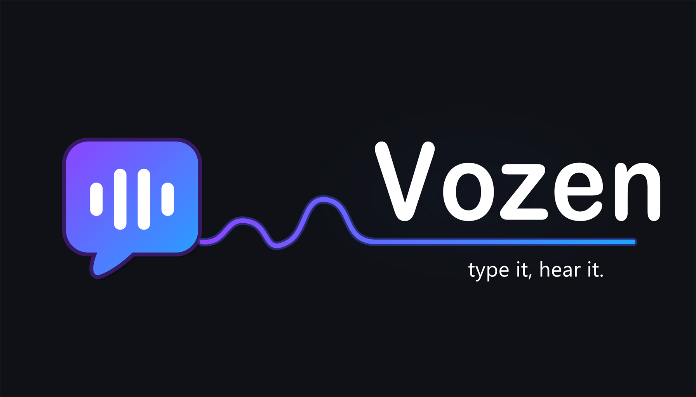

<h1 align="center">Vozen</h1>

<em>type it, hear it.</em>

  
  
  
  
  
  

**Vozen reads your messages out loud in Discord voice channels.** Type in a text
channel and everyone in the call hears it — useful when your mic is broken, when
you can't talk, or when you just don't want to.

The voice is **neural, not robotic** — and the good voice is the default, not a
paid unlock. Vozen also **reconnects on its own** when Discord drops it, instead
of going quiet for hours.

## Add it

**[→ Add Vozen to your server](https://discord.com/oauth2/authorize?client_id=1523826014935842997&permissions=3148800&scope=bot%20applications.commands)**

Then run **`/setup`** — it picks the channel to read and turns auto-read on. Join a
voice channel, type in the text channel, and you're done.

## What it does

- **Auto-read** — pick a channel with `/setup` and Vozen reads everything written
  there. No prefixes. It also reads mentions of and replies to the bot.
- **A voice per person** — everyone picks their own voice, speed and engine with
  `/voice config`, and it reads all of their messages in it.
- **30+ languages, detected automatically** — write in Portuguese, it answers in a
  Portuguese voice; switch to English mid-conversation and so does the voice.
- **Says who's talking** — "Diogo said hello", with nicknames you can set yourself.
- **Reads Discord, not markup** — emoji, links, code blocks, spoilers and mentions
  come out as something a human would say.
- **Stays in the call** — automatic reconnection; auto-leave when the channel empties.
- **Games in voice** — `/game play` has 15+ games: Wordle, Hangman, Guess the
  Language, Dictation, Reflexes, Word Chain and more.
- **Fun commands** — `/joke`, `/laugh`, `/8ball`, `/fortune`, `/fact`, `/wyr`,
  `/randomizer`, `/sound`, `/birthday`.
- **Moderation** — blocked words, per-user rate limit, character cap, role gating
  and per-channel control, all under `/config`.
- **The interface speaks your language** — the bot's own replies are translated
  into 30+ languages and follow each person's Discord language.

## Commands worth knowing

| Command          | What it does                                         |
| ---------------- | ---------------------------------------------------- |
| `/setup`         | One-step setup for the server                        |
| `/join` `/leave` | Bring Vozen into your voice channel, or send it away |
| `/tts`           | Read one message out loud                            |
| `/voice config`  | Panel to pick your voice, speed and engine           |
| `/skip`          | Skip what's playing                                  |
| `/config`        | Server settings (needs Manage Server)                |
| `/help`          | The full command list                                |
| `/privacy erase` | Delete everything Vozen stores about you             |

## Premium

Vozen's core is free and always will be — including the neural voice. **Plus** and
**Premium** add extras like Google HD voices, 24/7 always-on, voice→text
transcription and higher limits.

**[→ Plans and prices at vozen.org](https://vozen.org/#premium)** · run `/premium info`
in Discord to see what you have.

## Support

Something broken, or an idea? **[Join the support server](https://discord.gg/V6PZYZmhcQ)**
— that's the fastest way to reach us. Bugs can also go in
[GitHub issues](https://github.com/Rexy40407/discord-bot-Vozen/issues).

## Self-hosting

Vozen is open source (AGPL-3.0), so you can run your own instance. Three paths —
there is nothing easier than inviting the hosted bot:

| Level      | Who it's for                             | How                                                                                                                                                                    |
| ---------- | ---------------------------------------- | ---------------------------------------------------------------------------------------------------------------------------------------------------------------------- |
| **Easy**   | Everyone                                 | [Invite the public bot](https://discord.com/oauth2/authorize?client_id=1523826014935842997&permissions=3148800&scope=bot%20applications.commands) — nothing to install |
| **Normal** | You want it on your own VPS              | `docker compose` — [self-hosting guide §5](docs/SELF-HOST.md#5-deploy-on-a-vps-docker)                                                                                 |
| **Hard**   | You want to change it or tune the voices | From source: Node + Piper + models — [self-hosting guide §1](docs/SELF-HOST.md#1-prerequisites)                                                                        |

## Privacy and terms

- [**Privacy Policy**](PRIVACY.md) — what is stored, for how long, and how to delete it.
  Message text is processed and thrown away; it is never used to train anything.
- [**Terms of Service**](TERMS.md) — acceptable use, warranties, liability.

## License

Copyright (C) 2026 Diogo Cabral.

Vozen is free software: you can redistribute it and/or modify it under the terms of the **GNU Affero
General Public License, version 3** (AGPL-3.0), as published by the Free Software
Foundation. See the [`LICENSE`](LICENSE) file for the full text.

AGPL-3.0 adds one key condition to the GPL: **anyone who runs a modified version of
Vozen accessible over a network must make that version's source code available to its
users**. This keeps Vozen open even when run as a service.

Vozen is provided WITH NO WARRANTY; see section 15 of the license.
